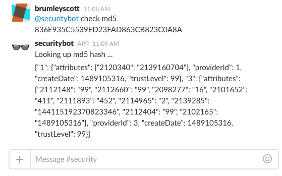

# OpenDXL Slack Integration with McAFee TIE (Threat Intelligence Exchange)

The OpenDXL Slack/TIE integration supports running in a "standalone" mode as well as execution within a
"Vagrant portable development environment". The steps for running in each of these
modes are detailed below.

## Usage (Standalone)

The following steps walk through running the OpenDXL Slack/TIE integration in standalone mode:

* Download the latest release of the [OpenDXL Slack/TIE integration](https://github.com/scottbrumley/opendxl-slack/releases/latest)
* Extract the downloaded release
* Provision the files necessary for an OpenDXL client (`dxlclient.config` and related certificate files).
  * The steps are identical to those described in the [OpenDXL Client Samples Configuration](https://opendxl.github.io/opendxl-client-python/pydoc/sampleconfig.html) documentation.
* Place the `dxlclient.config` and related certificate files into the same directory as the `dxl_bot.py` file (in the extracted release)
* Install the required Python dependencies using the `requirements.txt` in the release:
  * `pip install -r requirements.txt`
* Create a [Slack account](https://slack.com/create) (Team and User)
* [Generate a Token](https://api.slack.com/custom-integrations/legacy-tokens) for the Team and User
* Set the following environment variables:
  * `SLACK_BOT_TOKEN` (assign the generated token)
  * `BOT_NAME` (assign the name of the created Slack User)
* Run the TIE SlackBot via the `dxl_bot.py` file contained in the the release:
  * `python dxl_bot.py`
* Navigate to the newly created Slack Team (via Web Browser)
* Send a Slack message that triggers the TIE SlackBot to lookup a file reputation:
  * `@securitybot check md5 1c2a2d1853aafec963e5a62264f68134`
  * Replace `securitybot` with name of the Slack User that was created previously
* The SlackBot should respond with the reputations for the specified MD5 hash.



## Usage (Vagrant portable development environment)

### Prerequisites
 [Requirements](docs/requirements.md)

### How to get this repo working

1. git clone https://github.com/scottbrumley/opendxl-slack.git
2. Run vssh.sh (On Windows Launch from Git Bash)
3. At vagrant@vagrant-ubuntu-trusty-64:/ prompt type cd /vagrant

#### Example
```
./vssh.sh on Linux/Mac OS
vssh.sh on Windows (make sure windows has Git ssh in PATH)
```

#### Running the bot
```
python dxl_bot.py
```

#### Slack Commands
1. Invite Your Bot Into Channel /invite @mybot
2. Ask Bot for File Reputation "i.e. @securitybot check md5 836E935C5539ED23FAD863CB823C0A8"

### Phoenix the Environment
If you want to burn the whole thing to the ground just exit the guest and use this command.
```
exit
./vclean.ssh
```

#### About Vagrant
https://www.vagrantup.com/

Vagrant uses the Vagrantfile to build environment.  Important lines:
```
config.vm.box = "sbrumley/opendxl"
config.vm.provision "shell", path: "scripts/bootstrap.sh"
```

### About Git
https://git-scm.com

Git is a free and open source distributed version control system designed to handle everything from small to very large projects with speed and efficiency.

## LICENSE

Licensed under the Apache License, Version 2.0 (the "License"); you may not use this file except in compliance with the License. You may obtain a copy of the License at

http://www.apache.org/licenses/LICENSE-2.0

Unless required by applicable law or agreed to in writing, software distributed under the License is distributed on an "AS IS" BASIS, WITHOUT WARRANTIES OR CONDITIONS OF ANY KIND, either express or implied. See the License for the specific language governing permissions and limitations under the License.
